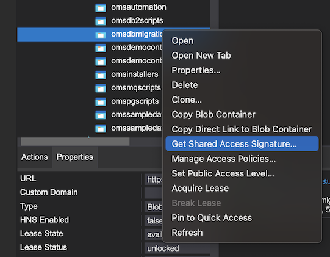
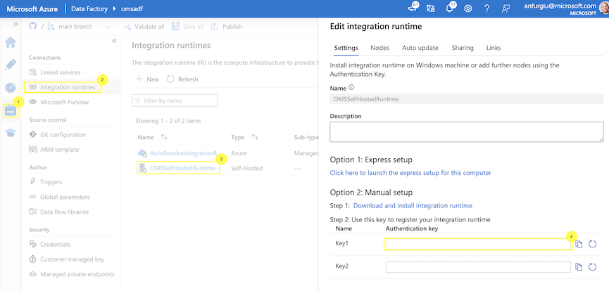
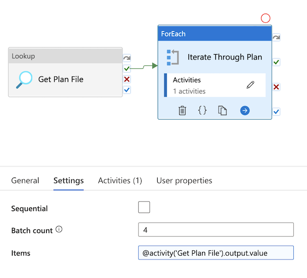

# Data Migration Process - DB2 to Azure PostgreSQL

If you are planning a data migration from IBM DB2 to Azure PostgreSQL as part of your OMS Deployment, one of the biggest challenges you will face is how you will handle your data migration. One potential solution to consider is using a tool like Azure Data Factory (ADF) to help you move your tables and views.

Inside this folder is a sample pipeline that is designed to iterate over a series of tables and copy them from your DB2 instance to your Azure PostgreSQL Database. You can copy this data from almost any location, provided you use the Self Hosted Integration Runtime feature of ADF to securely and privately connect to your DB2 instances ()

## Process Overview

The idea of this data pipeline is to take a set of tables and copy their contents from one source database to another using a set of copy activities. Using nested pipelines Azure Data Factory, this can be accomplished by:

1. Reading in a configuration file from an Azure Storage Account that defines the list of tables to copy,
2. Iterating over the list of tables and doing paralell/simultanious copies of each

One of the main challenges this pipeline solves is automatic mapping of data types between DB2 and Postgres, as well as things like case sensitivity on the Postgres side for objects.

## Important Note: Production Readiness

This ADF pipeline is provided for demonstration and testing purposes only; you **should not** run this in any production capacity without thorough testing and planning under any circumstance! This process was tested with a sample OMS dataset from IBM DB2 to Azure Postgres Flexible Server.

## Setting up

Before you begin, you need to make sure that you have a source DB2 Database that contains your data and a target destination Azure PostgreSQL Database. You will also need access to a user account that can read all the source tables, as well as write to the target tables on the Postgres side. Furthermore, this tool only works on the assumption that your tables exist both places. As such, it's best to do an OMS deployment and use the new deployment to create your empty schema.

**Database/Schema/Object Ownership Note:** If you choose NOT to use the same user/role that OMS will be using when you migrate your data (or create your database/schema/objects), note that you should take the time to change ownership of the objects prior to deploying OMS, especially if you need to run any DataMangement tasks (as part of an upgrade/fixpack).

### Define Migration Plan

This process works off of a defined migration plan in the form of an XML configuration file. A sample file is provided in this repository, but the general idea is an array of JSON objects that contain the source table to copy, the source schema of the table, and if the target table on the destination side should be truncated or not. If you'd like to specify a "WHERE" clause for your source data (for instance all data up until a particular date/time) you can write that SQL statement in the "whereClause" section (an empty where clause will copy all table data).

Example:

```json
[
    {
        "table": "YFS_INVENTORY_SUPPLY",
        "schema": "oms",
        "doTruncate": true,
        "whereClause": "createts > '12/28/2022 08:00:00'"
    },
    {
        "table": "YFS_INVENTORY_ITEM",
        "schema": "oms",
        "doTruncate": true,
        "whereClause": ""
    }    
]
```

Save this file with a .xml extension.

### Create Storage Account for your migration plan

The ADF pipeline will need to read this migration plan. You can create a generic Azure Blob Storage account and within it create a new container that contains just this file. Then, generate a SAS token for the container. You can do this with the Azure CLU or Azure Storage Explorer:



### Deploy Data Factory using ARM Template

Inside the ```adf``` folder is a ARM template that contains all the basic artifacts of your pipeline: data sources, data sets, and pipelines. If you import this template into your resource group, will be prompted to provide some details like connection strings, database names, etc. Once you provide all of this information, the data factory should deploy with everything in place.  Note: This deployment will create a Self-Hosted IR that has no nodes attached to it (see below) so you won't be able to run the pipeline until you provide them.

### Install a Self-Hosted Integration Runtime and Connect to ADF Instance

Next, you need to set up your self-hosted integration runtime (SHIR). This is a utility that is designed to run on a Windows machine, and provides a way for the process to read data from your source DB2 instance. The general idea is that this SHIR should reside on a machine that can successfully connect to your source DB2 instance, whether that be on premises, in the cloud, etc.

You can download the latest SHIR runtime here: https://www.microsoft.com/en-us/download/details.aspx?id=39717

Once installed, you can connect your SHIR node to your ADF instance by obtaining your key from your "Integration Runtimes" section of your ADF instance:



## Running the Pipeline

Once you've connected your SHIR node, you're ready to run your pipeline. Open the pipeline named "Migrate Tables By Plan" and from the "Add Trigger" menu click "Trigger Now." This will start the process. You can monitor the overall pipeline and each step by using the monitor tab of your ADF instance.

## Tweaking Performance

You may have lots of data to move, so figuring out the most efficient process will be critical to making the process smooth and fast. As such there are a few things you can tweak to make this potentially go faster:

### Dropping and Recreating Indexes

On your target database, if any indexes exist on the target tables, you should drop them first before running the pipeline. Then, when the copies finish, add the indexes back. In PostgreSQL, you can script out each index with a query such as:

```pgsql
--Index maintenance scripts. SAVE EACH OUTPUT BEFORE RUNNING THE STATEMENTS!
--NOTE: Modify your WHERE clause for your schema(s)

--Script to recreate indexes:
select replace(pg_get_indexdef(format('%I.%I', schemaname, indexname)::regclass), ' INDEX ', ' INDEX IF NOT EXISTS ')||';' as ddl
from pg_indexes
where schemaname = 'oms'

--Script to generate DROP INDEX statements
select schemaname, 
       indexname, 
       tablename, 
       format('drop index %I.%I;', schemaname, indexname) as drop_statement
from pg_indexes
where schemaname = 'oms';
```

### Adjusting Parallel Copies

Inside your the pipeline "Iterate Through Plan" is a "ForEach" operator. In the settings for this operator is a setting for "Batch Count." This controls how many child pipelines run at a time (aka how many tables are simultaniously copied) 



It might be tempting to set to this a high value, but remember: it is very easy to saturate your network between your source an destination, and you may be limited in your read and/or write speeds at your source and destinations, respectively. The key is finding out what is feasible to maintain high performance. The current setting in this repository is four simultaneous copies.

### Scaling to more Self-Hosted IRs

Since this process is designed to use self-hosted integration runtimes, one way to increase throughput is to add more IR nodes. There is a limit of 4 nodes for a defined self-hosted IR. Adding more nodes can potentially increase your throughput as it provides additional compute resources to read and write your data.

## Contributing

This project welcomes contributions and suggestions.  Most contributions require you to agree to a
Contributor License Agreement (CLA) declaring that you have the right to, and actually do, grant us
the rights to use your contribution. For details, visit https://cla.opensource.microsoft.com.

When you submit a pull request, a CLA bot will automatically determine whether you need to provide
a CLA and decorate the PR appropriately (e.g., status check, comment). Simply follow the instructions
provided by the bot. You will only need to do this once across all repos using our CLA.

This project has adopted the [Microsoft Open Source Code of Conduct](https://opensource.microsoft.com/codeofconduct/).
For more information see the [Code of Conduct FAQ](https://opensource.microsoft.com/codeofconduct/faq/) or
contact [opencode@microsoft.com](mailto:opencode@microsoft.com) with any additional questions or comments.

## Trademarks

This project may contain trademarks or logos for projects, products, or services. Authorized use of Microsoft 
trademarks or logos is subject to and must follow 
[Microsoft's Trademark & Brand Guidelines](https://www.microsoft.com/en-us/legal/intellectualproperty/trademarks/usage/general).
Use of Microsoft trademarks or logos in modified versions of this project must not cause confusion or imply Microsoft sponsorship.
Any use of third-party trademarks or logos are subject to those third-party's policies.